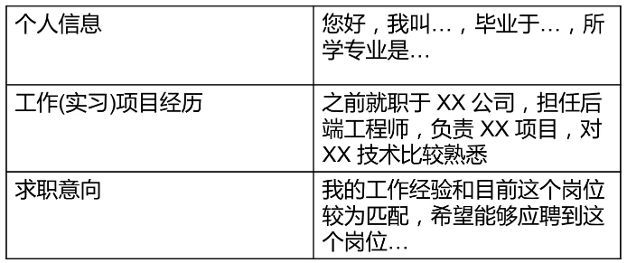

简历内容
    
    表现个优势，突出关键信息
        基本信息(姓名，学校，学历，联系方式等)
        职业技能(编程语言，框架，数据库，开发工具)
        关键项目经验(担任职责，用到哪些技术)
    
    简历自我评价
        可以尝试自我评价，保存内容简洁、态度真诚
        面试官评价
        
简历加分项

    知名项目经验
    技术栈比较匹配
    开源项目(github/技术博客/linux/unix geek)

简历注意事项
    
    内容简洁，突出重点。(一般为2页以内)
    注意格式，使用PDF(保证跨平台打开格式一致)
    信息真实，不弄虚作假。技能要和岗位匹配，没有太多无关内容。
    
自我介绍说什么
    
    个人信息
    掌握的技术，参与过的项目
    应聘的岗位，表达对岗位的看法和兴趣

不太会表达怎么办

    早准备
    多练习
    模拟面试
 