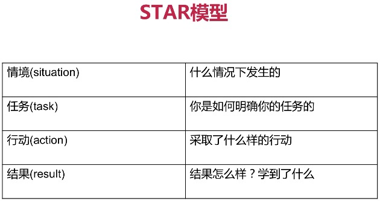
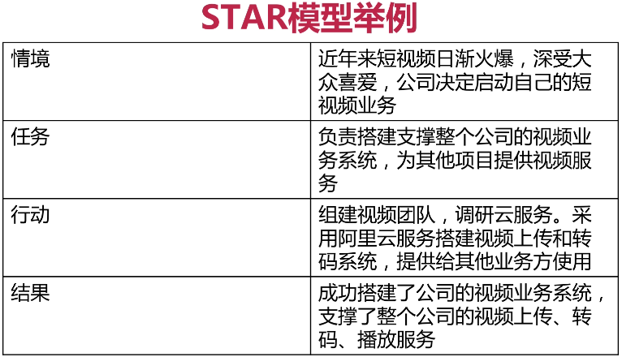
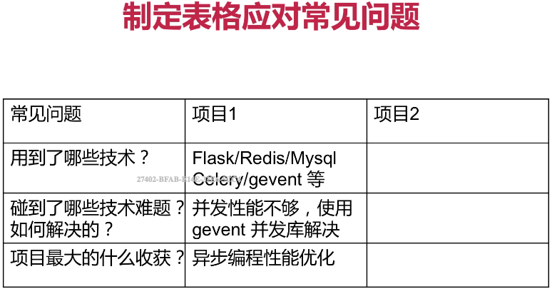
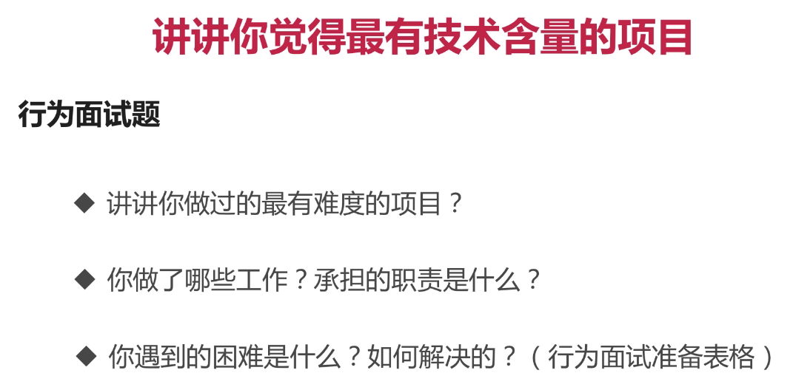

什么是行为面试
    
    根据候选人过去的行为评测其胜任能力
        理论依据：行为连贯性
        人在面对相似的场景时会倾向与重复过去的行为模式
        
行为面试常见问法
    
    行为面试的套路
        提问方式：说说你曾经...
        
        说说你做过的这个项目
        说说你碰到过的技术难题？你是如何解决的？有哪些收获？

常见问题
面试官一般会问：你还有什么要问我的吗？
    
    不要回答没有，直接说没有表明你对岗位缺乏了解和兴趣
    表现出兴趣: 问问工作内容(业务)、技术栈、团队、项目等
    问自己的感兴趣的一些技术问题，架构问题等

注意事项
聊天是个重要的软技能
    
    态度真诚，力求真实，不要弄虚作假
    言简意赅，突出重点，省略细枝末节。适当模拟练习
    采用STAR模型让回答更有条理

行为面试练习题

